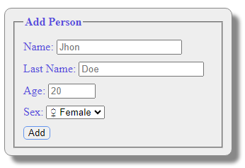

# Form Validation Example

A simple form for adding a new person to the server using a  submit _get_ . 

The code is developed using the benefits of HTML5 making a code easier to read.

Structure, looks and functionality of the project is separated in different files: **index.html**, **style.css** and **script.js** respectively.
